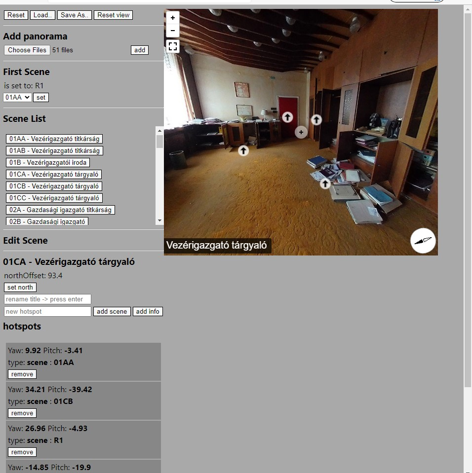

#Panorama editor

Virtual tour editor meant to create pannellum json config files

##how to run

`npm install`

then

`npm run start`

will create a developer server

a demo scene (iroda.json) is included 
