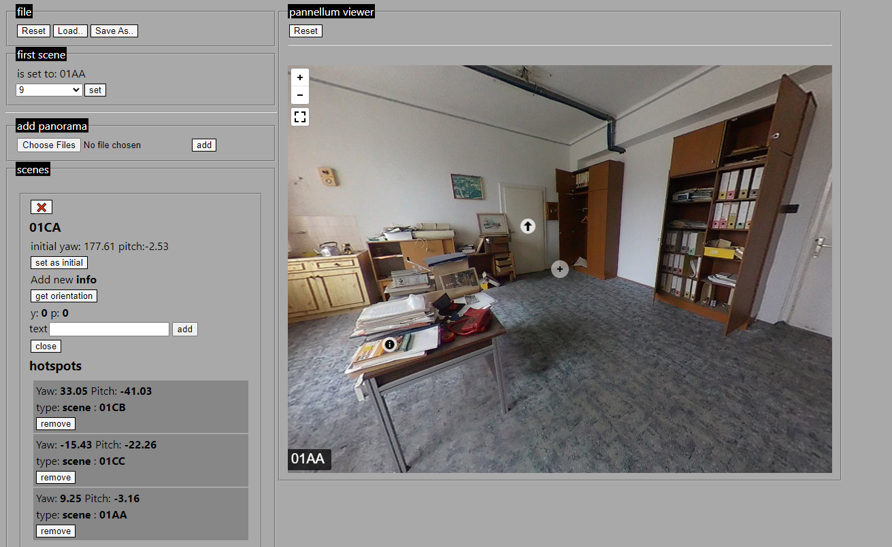
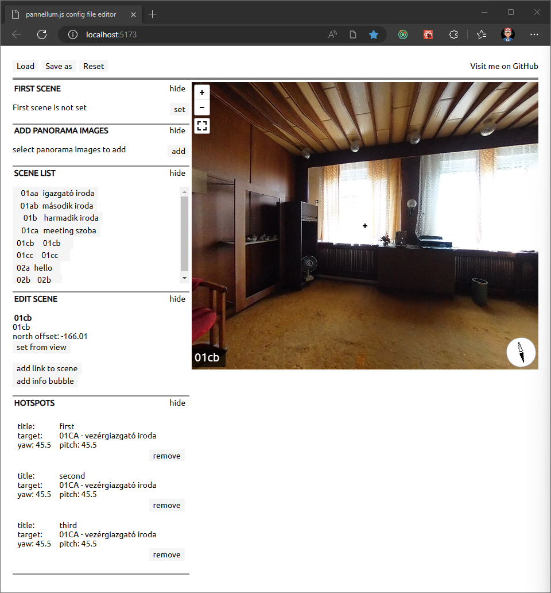

# Panorama editor

Web based tool to create pannellum.js scene files with some extended functionality

[panellum.js](https://pannellum.org/)

for an example finished tour, visit: 

https://laszloekovacs.github.io/cipogyar_build/?fbclid=IwAR3vIYyobRdnjUuKgiqO-ydVZyi9a6dPVCviuxPq0X7R7puF5GPi83rv7KE 

### quick guide
- select `try online with demo assets`
- from a list of images, press `add scene` to load that image into the project
- switch to editor tab
- select from `scene list` the scene you want to see int the preview window
- click on the `title` in `scene settings` to rename current scene
- you can add a hotspot that places an info spot at the center of the preview
- you can link scenes to eachother and clicking on the arrow will navigate to that scene

screenshots from old version

### How to run

The project uses vite. Run `npm run dev` to create a developement server

### notes & ideas & plans?
- replace redux with zustand maybe
- separate the internal state of the editor from panellum scene file
- -> have abstract converter that can be implemented for different viewers too
- update vite, tw, remove not used frameworks
